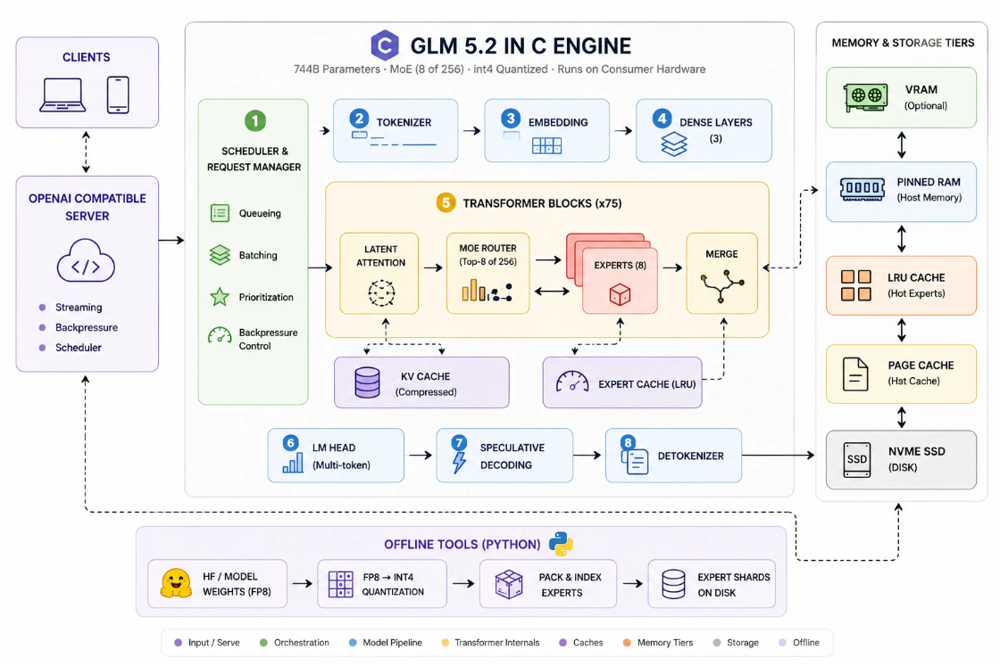
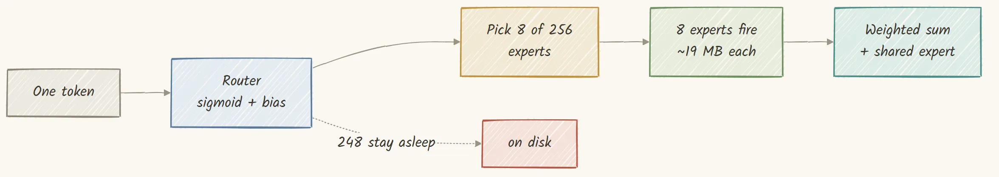

# **Building GLM 5.2 744B Model in C to Run on 25GB RAM**

## Quantize it to int4, stream the experts from disk, and serve it from one machine

++[GLM 5.2](https://huggingface.co/zai-org/GLM-5.2-FP8)++ is a **744 billion parameter** model, about 1.5 terabytes in bfloat16, and the usual way to run something that big is a rack of datacenter GPUs. But it is a ++[Mixture of Experts](https://huggingface.co/blog/moe)++, so only 8 of its 256 experts per layer fire for any given token, and most of the model sits asleep. If we keep the small always on part in memory and stream the sleeping experts from disk, the working set stays tiny even though the model on disk is enormous. So it can fit on **a laptop with about 16 gigabytes of RAM and no GPU**, running an engine we build from scratch in pure C.



Here is everything we build, all in one C file with no BLAS and no framework, top to bottom, one component at a time:

- **Set up and build**: inspect the box and the model, then compile the engine from a single C file into a 377 kilobyte binary.
- **Prove the idea small first**: a 400 line streaming engine for a smaller model, validated token for token against PyTorch.
- **Quantize FP8 to int4**: dequantize the vendor weights and repack them to 4 bits with per row scales, and measure what that costs.
- **Load weights by streaming**: index and read tensors on demand with `pread`, and drop the pages right after.
- **Run the forward pass**: multi head latent attention with a compressed KV cache, a sparse attention indexer, and the Mixture of Experts router.
- **Write the kernels**: integer dot products for int4 and int8 weights, checked bit for bit against a plain C reference.
- **Build the tiering system**: place experts across VRAM, pinned RAM, an LRU cache, the page cache, and disk, then prefetch and pipeline so compute overlaps the reads and it never runs out of memory.
- **Speculate**: draft tokens with the model’s own multi token head, with n grams, and with a grammar, then verify them losslessly.
- **Serve it**: an OpenAI compatible server with a proper scheduler, streaming, and backpressure.
- **Prove it works**: actual conversations, the full performance story, and the correctness checks that got us here.

Every number and every log line in this post comes from runs on our own hardware. All of the code is available in my GitHub repository (theory plus code):

[https://github.com/FareedKhan-dev/glm-5.2-in-c?source=post_page-----77a3df56e7b4---------------------------------------](https://github.com/FareedKhan-dev/glm-5.2-in-c?source=post_page-----77a3df56e7b4---------------------------------------)

The codebase is organized as follows.

```plaintext
glm-5.2-in-c/
├── engine/                     # the C engine
│   ├── glm.c                   # the whole engine in one file
│   ├── st.h, tier.h            # streaming loader and expert tiering
│   ├── olmoe.c                 # the 400 line stepping stone we build first
│   ├── backend_cuda.cu         # optional CUDA kernels
│   └── Makefile                # one command builds it
├── tools/                      # offline Python
│   ├── convert_fp8_to_int4.py  # the FP8 to int4 requantizer
│   └── make_glm_oracle.py      # the tiny PyTorch reference we validate against
├── cli/                        # entry point and server
│   └── openai_server.py        # the OpenAI compatible API
├── docs/                       # the longer theory write ups
├── results/                    # every log and number quoted in this post
├── deploy/                     # provisioning and run scripts
└── bench/                      # the capture scripts behind the results
```

So let us get started and build it up, one piece at a time.

## Table of Contents

- [Why a 744B Model Can Fit](https://levelup.gitconnected.com/building-glm-5-2-744b-model-in-c-to-run-on-25gb-ram-77a3df56e7b4#0291)
- [The Model, and the Hardware It Runs On](https://levelup.gitconnected.com/building-glm-5-2-744b-model-in-c-to-run-on-25gb-ram-77a3df56e7b4#5b5a)
- [Building the Engine, One C File With No BLAS](https://levelup.gitconnected.com/building-glm-5-2-744b-model-in-c-to-run-on-25gb-ram-77a3df56e7b4#c075)
- [The Math Primitives, Written by Hand](https://levelup.gitconnected.com/building-glm-5-2-744b-model-in-c-to-run-on-25gb-ram-77a3df56e7b4#e274)
- [First, the Streaming Idea in 400 Lines](https://levelup.gitconnected.com/building-glm-5-2-744b-model-in-c-to-run-on-25gb-ram-77a3df56e7b4#7df9)
- [Quantization: From FP8 to int4](https://levelup.gitconnected.com/building-glm-5-2-744b-model-in-c-to-run-on-25gb-ram-77a3df56e7b4#cc75)
- [What Does int4 Actually Cost?](https://levelup.gitconnected.com/building-glm-5-2-744b-model-in-c-to-run-on-25gb-ram-77a3df56e7b4#ac67)
- [Loading Weights by Streaming, Not Loading](https://levelup.gitconnected.com/building-glm-5-2-744b-model-in-c-to-run-on-25gb-ram-77a3df56e7b4#7a66)
- [Attention: Multi head Latent Attention With a Tiny KV Cache](https://levelup.gitconnected.com/building-glm-5-2-744b-model-in-c-to-run-on-25gb-ram-77a3df56e7b4#55af)
- [The Lightning Indexer: Sparse Attention When It Helps](https://levelup.gitconnected.com/building-glm-5-2-744b-model-in-c-to-run-on-25gb-ram-77a3df56e7b4#1468)
- [MoE Routing and Expert Dispatch](https://levelup.gitconnected.com/building-glm-5-2-744b-model-in-c-to-run-on-25gb-ram-77a3df56e7b4#089e)
- [The Kernels: Integer Dot Products](https://levelup.gitconnected.com/building-glm-5-2-744b-model-in-c-to-run-on-25gb-ram-77a3df56e7b4#965e)
- [The Tiering System](https://levelup.gitconnected.com/building-glm-5-2-744b-model-in-c-to-run-on-25gb-ram-77a3df56e7b4#a6f6)
- [Hiding the Disk Latency](https://levelup.gitconnected.com/building-glm-5-2-744b-model-in-c-to-run-on-25gb-ram-77a3df56e7b4#b642)
- [Speculative Decoding, Three Ways](https://levelup.gitconnected.com/building-glm-5-2-744b-model-in-c-to-run-on-25gb-ram-77a3df56e7b4#f40b)
- [Serving It: an OpenAI Compatible API](https://levelup.gitconnected.com/building-glm-5-2-744b-model-in-c-to-run-on-25gb-ram-77a3df56e7b4#fd38)
- [Does It Actually Work? Live Conversations](https://levelup.gitconnected.com/building-glm-5-2-744b-model-in-c-to-run-on-25gb-ram-77a3df56e7b4#5d1d)
- [The Performance Story, Measured](https://levelup.gitconnected.com/building-glm-5-2-744b-model-in-c-to-run-on-25gb-ram-77a3df56e7b4#c846)

∘ [It Runs on Hardware You Own](https://levelup.gitconnected.com/building-glm-5-2-744b-model-in-c-to-run-on-25gb-ram-77a3df56e7b4#b983)

- [How We Knew It Was Correct](https://levelup.gitconnected.com/building-glm-5-2-744b-model-in-c-to-run-on-25gb-ram-77a3df56e7b4#f75d)
- [Running It End to End](https://levelup.gitconnected.com/building-glm-5-2-744b-model-in-c-to-run-on-25gb-ram-77a3df56e7b4#8fd1)

## Why a 744B Model Can Fit

The problem is not “buy more GPUs.” It is to stop pretending you need all 744 billion parameters at once. A Mixture of Experts model has a router that, for each token, picks a few experts and ignores the rest.



One token routes to only 8 of 256 experts, so the rest stay asleep on disk

Let me put some numbers on this. GLM 5.2 has 78 layers, the first 3 dense and the other 75 with 256 experts each. The router picks the top 8 per token, so only about 3 percent of the experts fire.

That sparsity is the point. The always on part is about 17 billion parameters, or 9.9 gigabytes at 4 bits, and it stays in RAM. The routed experts are the other 727 billion, about 362 gigabytes on disk.

And only 8 experts per layer change from one token to the next. So of that 362 gigabytes, only about 11 gigabytes are touched per token, mostly the same hot experts over and over.

Press enter or click to view image in full size


How much of the model actually runs per token (Created by

[Fareed Khan](https://medium.com/u/b856005e5ecd?source=post_page---user_mention--77a3df56e7b4---------------------------------------)

)

Now for the size of one expert. Its weight is an `O` by `I` matrix, and at 4 bits we pack two values per byte, so it is `O` times `ceil(I/2)` bytes plus one scale per row.

Press enter or click to view image in full size


The byte cost of one int4 expert (Created by @fareedkhandev)

For GLM 5.2 that is three matrices, gate, up, and down, about 19 megabytes per expert. That 19 megabyte read is the unit of work, and the whole post is about making it cheap, cached, or skipped.

## The Model, and the Hardware It Runs On

Before writing a line of the engine, let us look at what we are running and what it actually asks of a machine. The surprising part is how little it asks, and that is the whole reason this fits on hardware you own.

Press enter or click to view image in full size


One glm binary and the same model, from a laptop you own up to the bench we measure on (Created by

[Fareed Khan](https://medium.com/u/b856005e5ecd?source=post_page---user_mention--77a3df56e7b4---------------------------------------)

)

The floor: a machine you already own

CPU     any modern x86-64 (AVX2 helps) or Apple Silicon

RAM     about 16 to 26 GB

disk    an NVMe SSD with room for the int4 model

GPU     none required

As we just saw, only about 10 gigabytes of this model ever needs to stay resident, and the rest streams from disk on demand.

So the floor is not a datacenter. It is a normal machine with a normal amount of RAM and a fast enough disk.

Here is that floor, the machine this is for.

People run this exact 744 billion parameter model in pure C, with the experts streamed from disk, on a Framework 13 laptop at about 0.37 tokens per second and on a desktop at around 0.1 to 0.3.

> I will show the full spread of machines at the end. The point for now is that no GPU and no server appears in that list.

So why does the rest of this post talk about a much bigger box? Because we do our measuring on one, and I would rather be plain about that than hide it.

Our development bench is a single workstation with 4 NVIDIA L40 GPUs, an AMD EPYC 7763 CPU, 228 gigabytes of RAM, and a 3.2 terabyte NVMe drive. We use it because it gives clean, repeatable numbers, and because it lets us show what headroom buys, not because you need it.

Here is its CPU and memory picture, captured with `lscpu` and `free`.

Model name:            AMD EPYC 7763 64-Core Processor

CPU(s):                124

Thread(s) per core:    1

Core(s) per socket:    62

Socket(s):             2

NUMA node(s):          2

L3 cache:              1.9 GiB

CPU AVX flags (note: AVX2 present, NO avx512/vnni)

avx avx2 fma sse4_1 sse4_2

```plaintext
           total        used        free      shared  buff/cache   available  

```

Mem:           228Gi       136Gi       2.9Gi        51Mi        90Gi        91Gi

Swap:             0B          0B          0B

The one line I want you to notice is the AVX flags. This CPU has AVX2 and FMA, but it does not have AVX-512 or the VNNI integer dot instructions. That matters a lot later, because our fastest integer kernels would love VNNI, and we will have to fall back to AVX2 and measure what we actually get.

Writing the number down now saves confusion when the kernel section arrives.

Here are the 4 GPUs, from `nvidia-smi`.

NVIDIA-SMI 570.195.03   Driver Version: 570.195.03   CUDA Version: 12.8

GPU  Name          Memory-Usage         GPU-Util

0  NVIDIA L40    44543MiB / 49140MiB      0%

1  NVIDIA L40    44543MiB / 49140MiB      0%

2  NVIDIA L40    44545MiB / 49140MiB      0%

3  NVIDIA L40    44543MiB / 49140MiB      0%

Four L40 cards, about 49 gigabytes each, for a total of roughly 196 gigabytes of VRAM. Notice they are already 44.5 gigabytes full and the utilization is 0 percent. That is the engine at rest with experts pinned into VRAM, a luxury this bench has and the floor does not. On a machine with no GPU the same binary simply streams those experts from RAM and disk instead. We will get to how they got there.

So we run the experiments on this bigger box because it is faster to analyze and test, but everything it does the cheapest machine does too, only slower.

The entire software dependency surface is three tools.

gcc (Ubuntu 13.3.0-6ubuntu2~24.04.1) 13.3.0

nvcc: Cuda compilation tools, release 12.8, V12.8.93

Python 3.12.3

A C compiler for the engine, `nvcc` for the optional GPU backend, and Python only for the offline weight conversion. The running engine imports none of them. Now the model itself. The architecture lives in `config.json`, and these are the fields that shape everything we write.

{

"architectures": ["GlmMoeDsaForCausalLM"],

"model_type": "glm_moe_dsa",

"hidden_size": 6144,

"num_hidden_layers": 78,

"first_k_dense_replace": 3,

"num_attention_heads": 64,

"num_key_value_heads": 64,

"n_routed_experts": 256,

"num_experts_per_tok": 8,

"n_shared_experts": 1,

"moe_intermediate_size": 2048,

"q_lora_rank": 2048,

"kv_lora_rank": 512,

"qk_nope_head_dim": 192,

"qk_rope_head_dim": 64,

"v_head_dim": 256,

"index_head_dim": 128,

"index_n_heads": 32,

"index_topk": 2048,

"num_nextn_predict_layers": 1,

"vocab_size": 154880,

"scoring_func": "sigmoid",

"topk_method": "noaux_tc",

"routed_scaling_factor": 2.5,

"rope_parameters": { "rope_theta": 8000000 },

"quantization_config": {

"quant_method": "fp8", "fmt": "e4m3", "weight_block_size": [128, 128]

}

}

There is a lot here, and we will meet each field when it matters. For now, the shape of the model is hidden size 6144, 78 layers with the first 3 dense, 256 experts per layer with top 8 routing, and one shared expert.

The attention is Multi head Latent Attention, which is the `q_lora_rank`, `kv_lora_rank`, and the split `qk_nope` and `qk_rope` head dims. There is a sparse attention indexer with `index_topk` of 2048. There is a multi token prediction head.

And the last field is the important one for the next section: the vendor ships this model in FP8, in the `e4m3` format, with 128 by 128 block scales.

When we run our own small status tool, it reads the config and the machine and prints a one screen summary, a quick sanity check that everything lines up.

model      /nvme/glm52_i4

arch       hidden 6144 · 78 layer · 256 expert/layer · top-8

shards     144 files · 384 GB on disk

RAM        239 GB total · 232.6 GB available

disk       3029 GB free

engine     ready

So the model is 384 gigabytes on disk across 144 shards, and the bench has plenty of RAM to spare. This status tool prints the total as 239 gigabytes where `free` rounds it to 228, but either way the model itself needs only about 10 gigabytes resident, so the rest is headroom for caching hot experts. Note the directory name, `glm52_i4`. That `i4` is int4, our own 4 bit conversion of the vendor’s FP8 weights. We will build that conversion ourselves in a couple of sections.

## Building the Engine, One C File With No BLAS

The engine is a single C translation unit, `glm.c`, of about 3,900 lines, plus a handful of header only helpers. There is no BLAS, no framework, and nothing to link except the math library and OpenMP.

I like this because it means the whole thing compiles in a second and the binary is small enough to read the disassembly if you ever need to.

Press enter or click to view image in full size


One C file plus small headers becomes a tiny static binary (Created by

[Fareed Khan](https://medium.com/u/b856005e5ecd?source=post_page---user_mention--77a3df56e7b4---------------------------------------)

)

That is the whole CPU build. `-O3` for optimization, `-march=native` so the compiler uses the AVX2 and FMA our CPU has, and `-fopenmp` for the thread parallelism inside our matmuls. It links `libm` and `libgomp` and nothing else.

nvcc -O3 -std=c++17 -arch=sm_89 -c backend_cuda.cu -o backend_cuda.o

gcc -O3 -march=native -fopenmp -DGLM_CUDA glm.c backend_cuda.o -o glm -lm -fopenmp \

-L/usr/local/cuda/lib64 -lcudart -lstdc++

If we want the optional GPU backend, we compile one extra CUDA file and link the CUDA runtime.

Building for CPU is one command, and here is the exact line the build runs.

gcc -O3 -march=native -fopenmp -Wall -Wextra glm.c -o glm -lm -fopenmp

The GPU is strictly optional. The `-DGLM_CUDA` define is the only thing that pulls in the CUDA path, and `-arch=sm_89` targets the Ada architecture of the L40. If you never pass that define, you get a pure CPU engine that runs on a laptop.

Let me show you how small the result is.

-rwxrwxr-x 1 ubuntu ubuntu 376648 Jul 14 06:37 glm

The whole engine is a 376,648 byte binary, about 377 kilobytes. A 744 billion parameter model driven by a 377 kilobyte program.

We also have a set of unit tests, and every one of them is built and run on its own so a failure is easy to localize. Let us run them and see.

----- test_json -----          json tests: ok

----- test_st -----            safetensors primitive tests: ok

----- test_tier -----          tier tests: ok

----- test_grammar -----       test_grammar: ok

----- test_decode_batch -----  decode batch helper tests: ok

----- test_idot -----          idot kernel exactness (avx2): ok

----- test_i4_acc512 -----     test_i4_acc512: skipped (no AVX-512 on this build)

Everything passes, and one test is deliberately skipped. The `test_i4_acc512` test checks an AVX-512 kernel, and this EPYC has no AVX-512, so the test skips instead of pretending.

The headline line for me is `idot kernel exactness (avx2): ok`, which is the proof that our hand written AVX2 integer dot product matches a plain C reference bit for bit. We will look at that kernel later.

One small but important detail about the build and the runtime. The per expert matmuls are tiny and back to back, and with OpenMP’s default passive wait policy the worker threads get parked between regions and the wake up latency dominates.

The engine fixes this by setting the OpenMP thread policy to active spin and then re executing itself once so a fresh OpenMP runtime picks up the setting. On the Zen build this took the matmul time from 66.9 seconds down to 20.9 seconds with no change to the output.

It is the kind of thing you only find by measuring, and you see it in the logs as a one line notice at startup.

[OMP] hot-thread tuning: re-exec once (GLM_NO_OMP_TUNE=1 to skip)

## The Math Primitives, Written by Hand

Before the big components, let us start with the small ones, because the whole engine stands on a handful of tiny math functions that we wrote ourselves. There is no library underneath, so every normalization, every activation, and the rotary position embedding is a few lines of C.

The first is RMS normalization, which the model applies before attention and before the feed forward. It divides each vector by the root mean square of its own elements, then scales by a learned weight.

/* RMS norm: divide by the root-mean-square of the vector, then scale by w. */

static void rmsnorm(float *out, const float *x, const float *w, int D, float eps) {

double ms = 0; for (int i = 0; i < D; i++) ms += (double)x[i] * x[i];

float r = 1.f / sqrtf((float)(ms / D) + eps);

for (int i = 0; i < D; i++) out[i] = x[i] * r * w[i];

}

We accumulate the sum of squares in a double, not a float, because a 6144 element vector loses precision if you add thousands of squares in single precision, and that precision is part of what lets us match the reference exactly. The next two are the softmax and the SiLU activation.

/* Softmax, shifted by the max for numerical stability. */

static void softmax(float *x, int n) {

float m = -1e30f; for (int i = 0; i < n; i++) if (x[i] > m) m = x[i];

float s = 0; for (int i = 0; i < n; i++) { x[i] = expf(x[i] - m); s += x[i]; }

for (int i = 0; i < n; i++) x[i] /= s;

}

/* SiLU, the activation inside every SwiGLU expert. */

static inline float siluf(float x) { return x / (1.f + expf(-x)); }

The softmax subtracts the maximum before it exponentiates, which is the standard way to avoid overflow. SiLU is one line. The last primitive is the rotary position embedding, which rotates pairs of query and key elements by an angle that grows with the token’s position, so attention can tell where each token sits.

/* Rotary position embedding, interleaved. Each pair (2j, 2j+1) is rotated by an

- angle that grows with the position, so attention becomes position-aware. */

static void rope_interleave(float *v, int pos, const Cfg *c) {

int half = c->qk_rope / 2; float in[256]; memcpy(in, v, c->qk_rope * sizeof(float));

for (int j = 0; j < half; j++) {

float inv = powf(c->theta, -2.0f * j / c->qk_rope);

float ang = pos * inv, cs = cosf(ang), sn = sinf(ang);

float a = in[2*j], b = in[2*j + 1];

v[j]        = a * cs - b * sn;

v[half + j] = b * cs + a * sn;

}

}

These few functions, plus the matmuls, are enough to assemble one transformer layer. A layer is a norm, then attention, then a residual add, then another norm, then the Mixture of Experts, or a dense feed forward for the first three layers, then another residual add. Here is exactly that, from the layer driver.

/* One layer: in_norm -> attention -> residual -> post_norm -> MoE/dense -> residual. */

for (int s = 0; s < S; s++) rmsnorm(nrm + (int64_t)s*D, x + (int64_t)s*D, l->in_ln, D, c->eps);

attention_rows(m, l, li, nrm, S, pos_base, kvs, positions, tmp);

for (int64_t j = 0; j < (int64_t)S*D; j++) x[j] += tmp[j];                 /* residual */

for (int s = 0; s < S; s++) rmsnorm(nrm + (int64_t)s*D, x + (int64_t)s*D, l->post_ln, D, c->eps);

if (l->sparse) moe(m, l, li, nrm, S, tmp);

else dense_mlp(l, nrm, S, D, c->dense_inter, tmp);

for (int64_t j = 0; j < (int64_t)S*D; j++) x[j] += tmp[j];                 /* residual */

Run that for all 78 layers, take the last position’s hidden state, normalize it one more time, and multiply by the output embedding to get the logits over the vocabulary. That loop, wrapped around the components we are about to build, is the entire forward pass.

Everything else in this post is about making each of those steps fit in memory and run fast.

## First, the Streaming Idea in 400 Lines

Before we take on the full 3,900 line engine for GLM 5.2, I want to prove the idea on something smaller and simpler. The idea is “keep the dense part resident, stream the experts from disk,” and we can show it works in about 400 lines of C for a smaller Mixture of Experts model.

This smaller engine is `olmoe.c`, and its only job was to reproduce the exact token ids of a reference before we scaled up. If the streaming approach is correct here, we can trust it when we make it complicated.


The streaming idea in miniature: dense resident, experts read on demand (Created by

[Fareed Khan](https://medium.com/u/b856005e5ecd?source=post_page---user_mention--77a3df56e7b4---------------------------------------)

)

/* One expert's weights, held quantized. Each matrix [out,in] is int8 per row

- plus one float scale per row. This is what takes the RAM cost from  
- 4 bytes/param (f32) down to 1 byte/param. We dequantize on use in the matmul. */

typedef struct { int eid; int8_t *g, *u, *d; float *gs, *us, *ds; uint64_t used; } Slot;

typedef struct { Slot *slots; int n, cap; } LCache;

The key part is how we hold an expert in memory. We do not keep experts as full precision floats, because that would defeat the purpose. We keep each weight matrix as int8, one byte per parameter, with one float scale per row.

That already takes the RAM cost from 4 bytes per parameter down to 1, and we dequantize on the fly inside the matmul. Here is the cache slot.

The `Slot` holds the three matrices of one expert, gate, up, and down, as int8 buffers, plus their per row scales, plus a `used` counter for least recently used eviction. The `LCache` is just an array of these slots, one cache per layer. Now the quantizer that fills those buffers.

It is symmetric and per row, which means for each output row we find the largest absolute value, divide it by the maximum representable integer to get a scale, and store the rounded quotient.

/* Quantize a weight [O,I] to int8 q[O,I] plus a per-row scale, symmetric.

- scale = max(|w|, over the row) / qmax, and q = round(w/scale). */

static void quantize_rows(const float *w, int8_t *q, float *scale, int O, int I, int bits) {

int qmax = (1 << (bits - 1)) - 1;     /* 8 bits -> 127, 4 bits -> 7 */

#pragma omp parallel for schedule(static)

for (int o = 0; o < O; o++) {

const float *wr = w + (int64_t)o * I;

float amax = 0.f;

for (int i = 0; i < I; i++) { float a = fabsf(wr[i]); if (a > amax) amax = a; }

float s = amax / qmax; if (s < 1e-8f) s = 1e-8f;

scale[o] = s;

int8_t *qr = q + (int64_t)o * I;

for (int i = 0; i < I; i++) {

int v = (int)lrintf(wr[i] / s);

if (v >  qmax) v =  qmax;

if (v < -qmax - 1) v = -qmax - 1;

qr[i] = (int8_t)v;

}

}

}

This is the exact quantization math we will reuse for the big model too, so it is worth reading carefully. Each row gets its own scale from its own maximum absolute value, we round to the nearest integer with `lrintf`, and we clamp into the int8 range. There is nothing clever here, and that is the point.

Simple, per row, symmetric quantization is enough to keep the model working, as we will confirm with numbers.

Now the streaming itself. When the router asks for an expert, we look it up in the per layer cache. If it is there, that is a hit and we bump its recency.

If it is not, that is a miss, and we either grow the cache or evict the least recently used slot, then read the three matrices from disk and quantize them into the slot.

/* Return the quantized weights of one expert, from cache or from disk.

- A hit bumps recency. A miss evicts the least-recently-used slot, then  
- reads the three matrices from disk and quantizes them into it. */

static void expert_get(Model *m, int layer, int eid, Slot **out) {

LCache *lc = &m->cache[layer];

for (int i = 0; i < lc->n; i++) if (lc->slots[i].eid == eid) {

m->hits++; lc->slots[i].used =++m->clock; *out = &lc->slots[i]; return;

}

m->miss++;

Slot *s;

if (lc->n < lc->cap) {                       /* room: grow the cache */

s = &lc->slots[lc->n++];

s->g = malloc(ng); s->u = malloc(ng); s->d = malloc(nd);

s->gs = falloc(c->inter); s->us = falloc(c->inter); s->ds = falloc(c->hidden);

} else {                                     /* full: evict the LRU slot */

int lru = 0;

for (int i = 1; i < lc->n; i++) if (lc->slots[i].used < lc->slots[lru].used) lru = i;

s = &lc->slots[lru];

}

/* read gate, up, down from disk (pread + fadvise DONTNEED), quantize into the slot */

load_expert_w(m, gate_name, s->g, s->gs, c->inter, c->hidden, tmp);

load_expert_w(m, up_name,   s->u, s->us, c->inter, c->hidden, tmp);

load_expert_w(m, down_name, s->d, s->ds, c->hidden, c->inter, tmp);

s->eid = eid; s->used = ++m->clock;

*out = s;

}

The `hits` and `miss` counters are how we will measure whether the cache is doing its job. And then the Mixture of Experts step ties it together. For each token, we run the router, take the top k experts, and for each one we fetch it from the cache, run the SwiGLU feed forward, and add its weighted contribution.

/* The MoE step for tokens x[S,hidden] -> out[S,hidden]. Route, take top-k,

- fetch each expert from cache, run its SwiGLU, add its weighted output. */

static void moe(Model *m, Layer *l, int layer, float *x, int S, float *out) {

Cfg *c = &m->c; int D = c->hidden, E = c->n_experts, K = c->topk, I = c->inter;

float *logits = falloc((int64_t)S * E);

matmul(logits, x, l->gate, S, D, E);

memset(out, 0, (int64_t)S * D * sizeof(float));

for (int s = 0; s < S; s++) {

float *pr = logits + (int64_t)s * E;

softmax_row(pr, E);

int idx[64]; float val[64];                  /* pick the top-K experts */

for (int kk = 0; kk < K; kk++) {

int best = -1; float bv = -1e30f;

for (int e = 0; e < E; e++) {

int taken = 0; for (int j = 0; j < kk; j++) if (idx[j] == e) { taken = 1; break; }

if (!taken && pr[e] > bv) { bv = pr[e]; best = e; }

}

idx[kk] = best; val[kk] = bv;

}

const float *xs = x + (int64_t)s * D;

for (int kk = 0; kk < K; kk++) {

Slot *e; expert_get(m, layer, idx[kk], &e);            /* cache or disk */

matmul_q(g, xs, e->g, e->gs, D, I);                   /* gate_proj */

matmul_q(u, xs, e->u, e->us, D, I);                   /* up_proj   */

for (int i = 0; i < I; i++) { float gv = g[i]; g[i] = (gv / (1.f + expf(-gv))) * u[i]; }

matmul_q(hh, g, e->d, e->ds, I, D);                   /* down_proj */

float w = val[kk];

float *os = out + (int64_t)s * D;

for (int d = 0; d < D; d++) os[d] += w * hh[d];       /* weighted add */

}

}

}

Read this and the big model’s Mixture of Experts step will feel familiar, because it is the same shape, only with more machinery bolted on. Route, select, fetch from cache or disk, run a SwiGLU, add. When we run this small engine against its reference, it matches token for token.

== Streaming C engine, cache = 16 experts/layer, experts @ 8-bit ==

resident weights loaded in ... | RSS after load: ... GB

Reference: 207 187 119 103 103 103 103 103 119 34 ...

C engine : 207 187 119 103 103 103 103 103 119 34 ...

Matching tokens: 20/20

Expert cache hit rate: ...  (hit=... miss=...)

Twenty out of twenty tokens match the reference. That is the whole reason `olmoe.c` exists. It is the small, solid proof that a dense resident, expert streaming engine can be exactly correct, not just approximately. Now we can scale the idea up to the full model with confidence.
